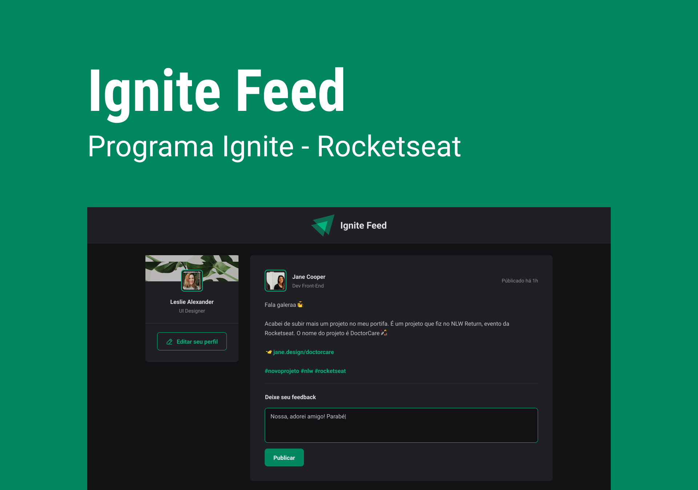

<div>
  
</div>

<br/>

## 📚 Informações sobre o projeto

- Esse projeto foi desenvolvido durante uma Aula da rocketseat no Chapter-1 do Ignite, na plataforma Rocketseat.

&nbsp;

## 🖼️ Template do projeto Figma

- [Template do projeto original para clone](https://www.figma.com/community/file/1113573231685349036)

<br/>   

## 🛠️ Tecnologias/Ferramentas ultilizadas

- [React](https://pt-br.reactjs.org/E)
- [TypeScript](https://www.typescriptlang.org/)
- [Vitejs](https://vitejs.dev/)
- [phosphor-icons](https://phosphoricons.com/)
- [date-fns](https://date-fns.org/)

## ⚙️ Instalação

```
# Abra um terminal e copie este repositório com o comando
$ git clone https://github.com/Hugovarellaa/ignite-feed
```

```
# Acesse a pasta da aplicação
$ cd ignite-feed
$ cd ignite-feed-typescript 

ou

$ cd ignite-feed 

# Instale as dependências
$ yarn

# Inicie a aplicação
$ yarn dev

```

---

<p align="center">Feito com 💙 por Hugo Alves Varella</p>